```mermaid
gitGraph
    commit id: "main-init" tag: "v0.1"

    %% develop 브ëœì¹˜ ì‹œì‘
    branch develop
    checkout develop
    commit id: "start-develop"

    %% feature ì‘ì—… (반복 구조를 ... 으로 표시)
    branch feature
    checkout feature
    commit id: "feature-work"
    checkout develop
    merge feature
    commit id: "..."
    commit id: "..."

    %% 최종 릴리스 (release 단어 제거)
    checkout main
    merge develop
    commit id: "v1.0" tag: "v1.0"


```

# 날씨모지-iOS


<br>

사용자의 현재 위치 날씨를 표시하고, 검색을 통해 다른 지역의 날씨도 확인할 수 있는 iOS 앱입니다. 

현재위치 기준으로 5일간의 일기예보를 제공합니다.

날씨 데이터는 **OpenWeatherMap API**를 통해 가져오며,

SnapKit으로 UI를 구성하고 RxSwift로 데이터 흐름을 관리했습니다.

<br>

## 프로젝트 소개 

<br>

**프로젝트 주제**: 날씨 앱 만들기

**프로젝트 이름**: 날씨모지(weather-moji)

**와이어프레임**: 🔗 [피그마](https://www.figma.com/design/opXqPOjbtH5fsH1qFMkqzO/%EB%82%A0%EC%94%A8%EB%AA%A8%EC%A7%80-%ED%94%BC%EA%B7%B8%EB%A7%88-%EB%B3%B4%EB%93%9C?node-id=0-1&t=ZezdfiaGKjz5e4A0-1)

## 🍎 날씨모지-iOS Team

<br>
<div align="center">

|김리하|신서연|이정은|
|-------------|--------------|-------------|
| <div align="center">[@RiHA039](https://github.com/RiHA039$0)</div> | <div align="center">[@hemssy](https://github.com/hemssy)</div>  | <div align="center">[@zzaeun](https://github.com/zzaeun)</div> |

</div>

<br>

## 개발 환경

&nbsp;&nbsp;&nbsp;&nbsp;&nbsp;&nbsp;&nbsp;&nbsp;&nbsp;
[](https://github.com/SnapKit/SnapKit)&nbsp;&nbsp;&nbsp; [](https://github.com/ReactiveX/RxSwift)


<br>

## 주요 기능 

| 기능 구분 | 설명 | 뷰 |
|------------|-------|-------------|
| **현재위치의 날씨표시** |  |  |
| **지역 날씨 검색** |  |  |
| **현재위치로 이동** |  |  |
| **서울 일기예보** |  |  |

<br>

## 아키텍처 개요 👷


<br>

### 🏗️ 계층별 역할
| 계층 구분 | 주요 폴더 | 책임 |
|------------|-------|-------------|
| **View** |  |  |
| **ViewModel** |  |  |
| **Model** |  |  |
| **Service** |  |  |

<br>

### 🏗️ 데이터 흐름


<br>

## 디렉토리 구조 🗂️

```text

```

<br>

--- 
## 코딩 컨벤션

1. 런타임 크래시를 방지하기 위해 강제 언래핑을 사용하지 않는다.
2. 이중 반복문 사용 등 코드가 복잡해지면 주석이나 PR에 설명을 상세하게 써놓는다.
3. 코드에 이모티콘을 추가하지 않는다.

<br>

## 깃 컨벤션

### 깃 플로우 전략



<br>

1. 작업할 내용에 대해서 이슈를 생성하고 이슈번호를 확인한다.
2. 나의 로컬에서 develop 브랜치가 최신화 되어있는지 확인한다.
3. develop 브랜치에서 새로운 이슈 브랜치를 생성한다.
    
     커밋타입/#이슈번호
     ex) feat/#1
    
4. 생성한 브랜치에서 작업을 시작한다.
5. 작업 완료 후, 에러가 없는지 확인하고 커밋 컨벤션에 맞춰 커밋한 후 push 한다.
6. PR을 작성한다.
7. 코드리뷰 후 수정사항 반영한 뒤, develop 브랜치에 merge 한다.
8. 머지 이후, 작업했던 브랜치는 삭제한다.

<br>

### 커밋타입
> `Feat`: 새로운 기능을 추가할 경우  
>
> 
> `Fix`: 버그를 고친 경우  
>
> 
> `Design`: CSS 등 사용자 UI 디자인 변경  
>
> 
> `Style`: 코드 포맷 변경, 세미 콜론 누락, 코드 수정이 없는 경우  
>
> 
> `Refactor`: 프로덕션 코드 리팩토링  
>
> 
> `Docs`: 문서를 수정한 경우  
>
> 
> `Test`: 테스트 추가, 테스트 리팩토링(프로덕션 코드 변경 X)  
>
> 
> `Chore`: gitignore 파일정리, 빌드 테스트 업데이트, 패키지 매니저를 설정하는 경우(프로덕션 코드 변경 X)  
>
> 
> `Rename`: 파일 혹은 폴더명을 수정하거나 옮기는 작업만인 경우  
>
> 
> `Remove`: 파일을 삭제하는 작업만 수행한 경우  

<br>

### 이슈 / PR 제목


**이슈 제목**: `[커밋타입] 작업 이름`

**PR 제목**: `[커밋타입] #이슈번호 - 작업 이름`

<br>

### 커밋 메시지


커밋 메시지는 `[커밋타입] #이슈번호 - 작업 이름` 으로 적는다.

**충돌 해결 merge 시**: `[Merge] develop->브랜치이름 머지`

**PR을 develop에 merge 시** : `[Merge] 브랜치이름->develop 머지`

<br>

---

## 개발일지 
### [위키 바로가기]()

<br>

## 트러블슈팅 🔫

### [위키 바로가기]()
