```mermaid
gitGraph
    commit id: "main-init" tag: "v0.1"

    %% develop 브ëœì¹˜ ì‹œì‘
    branch develop
    checkout develop
    commit id: "start-develop"

    %% feature ì‘ì—… (반복 구조를 ... 으로 표시)
    branch feature
    checkout feature
    commit id: "feature-work"
    checkout develop
    merge feature
    commit id: "..."
    commit id: "..."

    %% 최종 릴리스 (release 단어 제거)
    checkout main
    merge develop
    commit id: "v1.0" tag: "v1.0"


```

# 날씨모지-iOS


<br>

## 프로젝트 소개 

> [**OpenWeatherMap API**](https://openweathermap.org/api)를 활용해 실시간 날씨와 5일 예보 정보를 제공합니다.
> 
> 사용자가 선택한 지역의 날씨는 섭씨/화씨 단위 전환이 가능하며, 풍속과 습도 등의 기상 상태를 함께 표시해 종합적인 날씨 정보를 제공합니다.
>
> 날씨 상세 화면에서는 아이콘과 배경색이 지역의 기상 상태에 따라 **동적으로 변경**되어 직관적인 사용자 경험을 제공합니다.
>
> MVVM 아키텍처를 기반으로 **View / ViewModel / Model** 간의 의존성을 최소화하고, RxSwift와 NotificationCenter를 통해 화면 간 데이터 갱신을 효율적으로 처리했습니다.

<br>

**프로젝트 주제**: OpenWeather API를 활용해 지역 기반 날씨 정보를 제공하는 iOS 앱 만들기

**프로젝트 이름**: 날씨모지(weather-moji)

**와이어프레임**: 🔗 [피그마](https://www.figma.com/design/opXqPOjbtH5fsH1qFMkqzO/%EB%82%A0%EC%94%A8%EB%AA%A8%EC%A7%80-%ED%94%BC%EA%B7%B8%EB%A7%88-%EB%B3%B4%EB%93%9C?node-id=0-1&t=ZezdfiaGKjz5e4A0-1)

<br>

## 🍎 날씨모지-iOS Team

<div align="center">

|김리하|신서연|이정은|
|-------------|--------------|-------------|
| <div align="center">[@RiHA039](https://github.com/RiHA039)</div> | <div align="center">[@hemssy](https://github.com/hemssy)</div>  | <div align="center">[@zzaeun](https://github.com/zzaeun)</div> |

</div>

<br>

## 개발 환경

&nbsp;&nbsp;&nbsp;&nbsp;&nbsp;&nbsp;&nbsp;&nbsp;&nbsp;
[](https://github.com/SnapKit/SnapKit)&nbsp;&nbsp;&nbsp; [](https://github.com/ReactiveX/RxSwift)


<br>

## 주요 기능 

| 기능 구분 | 설명 | 뷰 |
|------------|-------|-------------|
| **현재위치의 날씨표시** | - 앱 실행 시 스플래시 화면 표시된 이후 메인 화면으로 전환 <br> - 메인화면에는 고정 위치인 서울의 현재 날씨를 기본으로 표시 <br> - **OpenWeatherMap API**를 통해 기온, 풍속, 습도, 날씨 상태를 조회 <br> - 날씨 상태(`main` 값)에 따라 배경 색상과 아이콘이 동적으로 변경됨 |  |
| **지역 날씨 검색** | - 사용자가 입력한 도시명을 기반으로 **OpenWeatherMap API** 호출 <br> - **RxSwift**를 활용해 **검색어 입력 -> API 요청 -> UI 업데이트** 흐름 구현 <br> - 검색 결과에 따른 온도(섭씨/화씨), 날씨 아이콘, 설명 문구 표시 |  |
| **현재위치로 이동** | - 서울을 기준 위치로 설정함 <br> - 현재위치 버튼 탭 시, `Seoul` 문자열을 고정적으로 방출하여 자동 검색 |  |
| **서울 일기예보** | - OpenWeatherMap의 **5 day / 3 hour API** 사용 <br> - 응답 중 `정오시각`의 데이터만 필터링하여 5일치 예보 표시 <br> - 각 셀은 요일, 날씨 아이콘, 기온 정보를 보여주는 리스트 형식으로 구성됨 |  |

<br>

## 아키텍처 개요 👷
**MVVM (Model–View–ViewModel)** 패턴을 적용했습니다. Model은 날씨 데이터와 관련된 구조체 및 API 응답 모델을 정의하고, ViewModel은 네트워크 요청 및 데이터 가공 로직을 담당하며, View는 변화된 날씨 정보를 화면(UI)에 반영하는 역할을 합니다.

<br>

### 🏗️ 계층별 역할
| 계층 구분 | 주요 폴더 | 책임 |
|------------|-------|-------------|
| **View** | `Features/Search/View`, `Features/Forecast/View`, `Features/Splash/View` | UIKit 기반 UI 구성, 사용자 입력 감지 및 ViewModel에 전달 |
| **ViewModel** | `Features/Search/ViewModel`, `Features/Weather/ViewModel`, `Features/Forecast/ViewModel` | Service로부터 받은 데이터를 가공하여 View에 전달 |
| **Model** | `Features/Weather/Model`| OpenWeatherMap API 응답 구조(`WeatherResponse`, `ForecastResponse`) 정의 |
| **Service** | `Network/WeatherService` | OpenWeatherMap API 통신 및 JSON 파싱 처리 |

<br>

### 🏗️ 데이터 흐름

1. 사용자가 도시명을 입력 -> **SearchViewModel**로 전달
2. WeatherViewModel이 입력값을 받아 **WeatherService**에 API 요청 수행
3. 응답받은 JSON 데이터를 `WeatherResponse`, `ForecastResponse` 모델로 디코딩
4. **ViewModel**이 온도/습도/풍속/날씨 설명/아이콘명 등을 가공
5. ViewModel의 **Rx 데이터를 View에서 구독**하여 UI 즉시 갱신
6. 날씨 상태에 따라 배경색, 아이콘, 문구 등이 자동 변경
7. 섭씨/화씨 토글 전환은 ViewModel 내부에서 즉시 반영

<br>

## 디렉토리 구조 🗂️

```text
weather-moji
├── 📂App
│   ├── AppDelegate.swift
│   └── SceneDelegate.swift
│
├── 📂Features
│   ├── 📂Alert
│   │   └── LocationManagerService.swift
│   │
│   ├── 📂Forecast
│   │   ├── 📂Model
│   │   │   └── ForecastResponse.swift
│   │   ├── 📂View
│   │   │   ├── ForecastCell.swift
│   │   │   └── ForecastViewController.swift
│   │   └── 📂ViewModel
│   │       └── ForecastViewModel.swift
│   │
│   ├── 📂Search
│   │   ├── 📂View
│   │   │   ├── SearchViewController.swift
│   │   │   └── TempToggleView.swift
│   │   └── 📂ViewModel
│   │       └── SearchViewModel.swift
│   │
│   ├── 📂Splash
│   │   └── 📂View
│   │       └── SplashViewController.swift
│   │
│   └── 📂Weather
│       ├── 📂Model
│       │   └── Weather.swift
│       └── 📂ViewModel
│           └── WeatherViewModel.swift
│
├── 📂Network
│   └── WeatherService.swift
│
├── 📂Resources
│   ├── 📂Color
│   │   ├── backgroundColor.swift
│   │   └── hexColor.swift
│   ├── Assets.xcassets
│   └── LaunchScreen.storyboard
│
├── Info.plist
│
└── 📦Package Dependencies
    ├── RxSwift 6.9.1
    └── SnapKit 5.7.1

```

<br>

--- 
## 코딩 컨벤션

1. 런타임 크래시를 방지하기 위해 강제 언래핑을 사용하지 않는다.
2. 이중 반복문 사용 등 코드가 복잡해지면 주석이나 PR에 설명을 상세하게 써놓는다.
3. 코드에 이모티콘을 추가하지 않는다.

<br>

## 깃 컨벤션

### 깃 플로우 전략



<br>

1. 작업할 내용에 대해서 이슈를 생성하고 이슈번호를 확인한다.
2. 나의 로컬에서 develop 브랜치가 최신화 되어있는지 확인한다.
3. develop 브랜치에서 새로운 이슈 브랜치를 생성한다.
    
     커밋타입/#이슈번호
     ex) feat/#1
    
4. 생성한 브랜치에서 작업을 시작한다.
5. 작업 완료 후, 에러가 없는지 확인하고 커밋 컨벤션에 맞춰 커밋한 후 push 한다.
6. PR을 작성한다.
7. 코드리뷰 후 수정사항 반영한 뒤, develop 브랜치에 merge 한다.
8. 머지 이후, 작업했던 브랜치는 삭제한다.

<br>

### 커밋타입
> `Feat`: 새로운 기능을 추가할 경우  
>
> 
> `Fix`: 버그를 고친 경우  
>
> 
> `Design`: CSS 등 사용자 UI 디자인 변경  
>
> 
> `Style`: 코드 포맷 변경, 세미 콜론 누락, 코드 수정이 없는 경우  
>
> 
> `Refactor`: 프로덕션 코드 리팩토링  
>
> 
> `Docs`: 문서를 수정한 경우  
>
> 
> `Test`: 테스트 추가, 테스트 리팩토링(프로덕션 코드 변경 X)  
>
> 
> `Chore`: gitignore 파일정리, 빌드 테스트 업데이트, 패키지 매니저를 설정하는 경우(프로덕션 코드 변경 X)  
>
> 
> `Rename`: 파일 혹은 폴더명을 수정하거나 옮기는 작업만인 경우  
>
> 
> `Remove`: 파일을 삭제하는 작업만 수행한 경우  

<br>

### 이슈 / PR 제목


**이슈 제목**: `[커밋타입] 작업 이름`

**PR 제목**: `[커밋타입] #이슈번호 - 작업 이름`

<br>

### 커밋 메시지


커밋 메시지는 `[커밋타입] #이슈번호 - 작업 이름` 으로 적는다.

**충돌 해결 merge 시**: `[Merge] develop->브랜치이름 머지`

**PR을 develop에 merge 시** : `[Merge] 브랜치이름->develop 머지`

<br>

---

## 개발일지 
### [노션 바로가기](https://www.notion.so/2a0b000d70fa802f8029ca44e2b08bc3?source=copy_link)

<br>

## 트러블슈팅 🔫

### [위키 바로가기](https://github.com/hemssy/WeatherMoji-iOS/wiki/👷-날씨모지-트러블슈팅)
